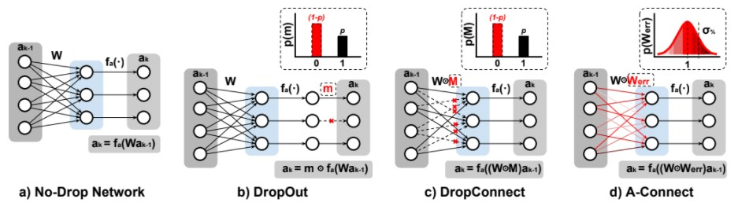

# A-Connect
Custom library for A-Connect training methodology for neural networks. Available only in Keras/TensorFlow.

## What is A-Connect?

A-Connect, is an ex-situ statistical training methodology to mitigate analog computation stochastic variability in neural networks, like the one caused by the mismatch in the synaptic cells. A-Connect methodology can include other types of neural network parameter corruption during training (e.g., weight quantization). Currently, A-Connect only supports the extreme case with binary weights.

## How A-Connect works?

Consider first a fully-connected layer like the one shown in Figure 2(a), which is the kind of neural network layer that naturally fits in an analog-based CIM architecture (Figure 1(b)). ak−1 represents the input activations (output activations from the previous layer), Wk the synaptic weights of the layer k, fa(·) the activation function, and ak the output activation. In an ideal digital implementation, these weights are unmodified by the hardware executing the neural network, but in an analog imple188 mentation, the weights will deviate from their ideal values due to hardware non-idealities, namely, stochastic variability. We modelled this deviation as represented in Figure 2(b), by multiplying (element-wise) the actual weights W with an error mask Werr. Supposing the behaviour of the synaptic cells follow a normal distribution, this mask will have a mean equal to 1 (ideal values), and 0 ≤ σ% ≤ 1, which represents the standard deviation relative to the absolute mean of the cells (σ% = σW /µW ).

## What do we need to use A-Connect in a project?

A-Connect was developed using Python 3.7 (in general 3.X), TensorFlow 2.4.1 and Numpy 1.20. So you must have this three components on your system in order to avoid compatibility issues. 
## Content description
In [AConnect](./AConnect) you can find the library and a fully description of the attributes of the layers. Finally, in [Examples](./Examples) you will find some examples of how to use the library.
