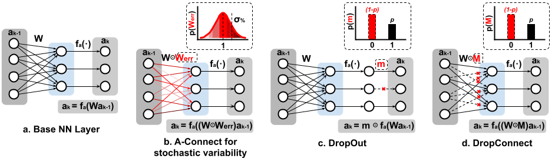

# A-Connect
Custom library for A-Connect training methodology for neural networks. Available only in Keras/TensorFlow.

## What is A-Connect?

A-Connect, is an ex-situ statistical training methodology to mitigate analog computation stochastic variability in neural networks, like the one caused by the mismatch in the synaptic cells. A-Connect methodology can include other types of neural network parameter corruption during training (e.g., weight quantization). Currently, A-Connect only supports the extreme case with binary weights.

## How A-Connect works?

Consider first a fully-connected layer like the one shown in Figure 1(a), which is the kind of neural network layer that naturally fits in an analog-based CIM architecture. a<sub>k−1</sub> represents the input activations (output activations from the previous layer), W<sub>k</sub> the synaptic weights of the layer k, f<sub>a</sub>(·) the activation function, and a<sub>k</sub> the output activation. In an ideal digital implementation, these weights are unmodified by the hardware executing the neural network, but in an analog implementation, the weights will deviate from their ideal values due to hardware non-idealities, namely, stochastic variability. We modelled this deviation as represented in Figure 1(b), by multiplying (element-wise) the actual weights W with an error mask W<sub>err</sub>. Supposing the behaviour of the synaptic cells follow a normal distribution, this mask will have a mean equal to 1 (ideal values), and 0 ≤ σ% ≤ 1, which represents the standard deviation relative to the absolute mean of the cells (σ% = σ<sub>W</sub> /µ<sub>W</sub> ).



Below, you can find a description about how A-Connect modifies the forward and backward propagation for a fully connected layer.

### Forward Propagation
During forward-propagation, a mini-batch of inputs a<sub>0</sub> are passed through the network. The weights W<sub>k</sub><sup>t−1</sup>
(as well as the biases b<sub>k</sub><sup>t−1</sup>), are multiplied element-wise by an error matrix randomly selected using a normal distribution (W<sub>k</sub><sup>err</sup> ←N<sub>n,m</sub>(1, σ<sub>%</sub><sup>2</sup>)). For A-Connect to be effective, it is important to select a different W<sub>k</sub><sup>err</sup>(and b<sub>k</sub><sup>err</sup>) mask for each training example within the mini-batch, since only one mask per mini-batch is not enough to regularize the model.

### Backward Propagation and Parameter Update
With A-Connect, the parameters update can be done using stochastic gradient descent (SGD) by back-propagating gradients of the loss function with respect to the layer’s parameters. The gradients of the loss function with respect to the weights (g<sub>Ŵ<sub>k</sub></sub>) and biases (g<sub>b̂<sub>k</sub></sub>), are multiplied by the error masks W<sub>k</sub><sup>err</sup> and b<sub>k</sub><sup>err</sup>, respectively, to obtain the proper gradients for the parameters update (g<sub>W<sub>k</sub><sup>t−1</sup></sub>, and g<sub>b<sub>k</sub><sup>t−1</sup></sub>). Finally, when back-propagating the activation gradients (g<sub>a<sub>k−1</sub></sub>), the masked weight matrix (Ŵ<sub>k</sub><sup>t−1</sup> = W<sub>k</sub><sup>t−1</sup>*W<sub>k</sub><sup>err</sup>) is used instead of the weight matrix (W<sub>k</sub><sup>t−1</sup> ). The gradients
for each parameter are averaged over the training examples in each mini-batch.

## What do we need to use A-Connect in a project?

A-Connect was developed using Python 3.7 (in general 3.X), [TensorFlow 2.4.1](https://www.tensorflow.org/install) and [Numpy 1.20](https://numpy.org/install/). So you must have this three components on your system in order to avoid compatibility issues.
If you want to plot some box charts you need to install [matplotlib 3.X](https://matplotlib.org/stable/users/installing.html).
## How to install A-Connect
If you want, you can use pip to install A-Connect typing:
```
pip3 install aconnect
```
Or you can copy and paste the folder aconnect to your project folder.
## Content description
In [AConnect](./AConnect) you can find the library and a fully description of project. [Examples](./Examples) there are some examples of how to use the library with two simple neural networks. One fully connected network and one convolutional network.

## Citing A-Connect
A-Connect is a project developed by Ricardo Vergel,Edward Silva, Luis Rueda and Elkim Roa. If A-Connect contributes to your project, please acknowledge this work by citing the original paper and citing this library.
